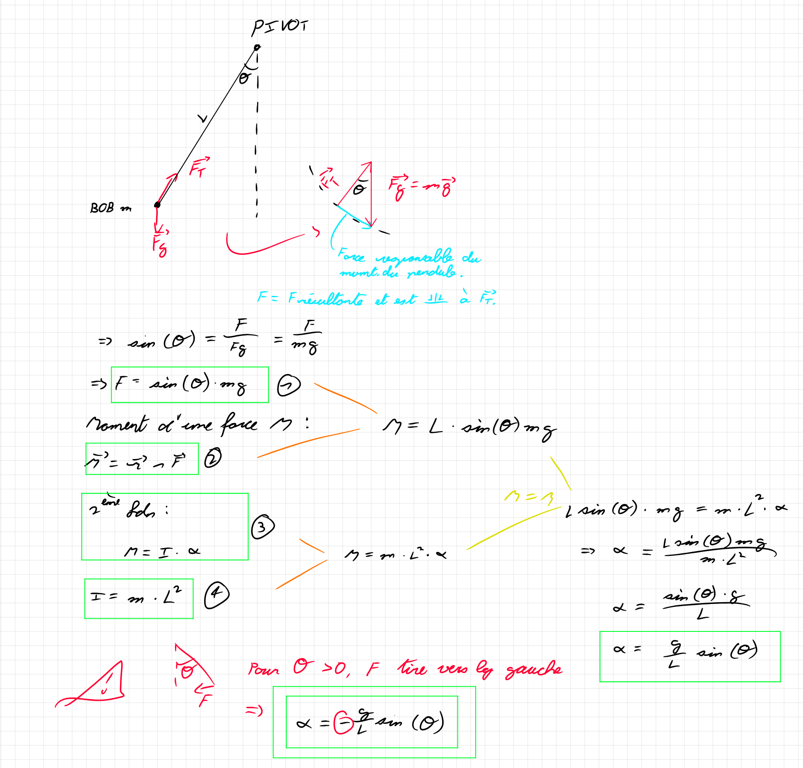
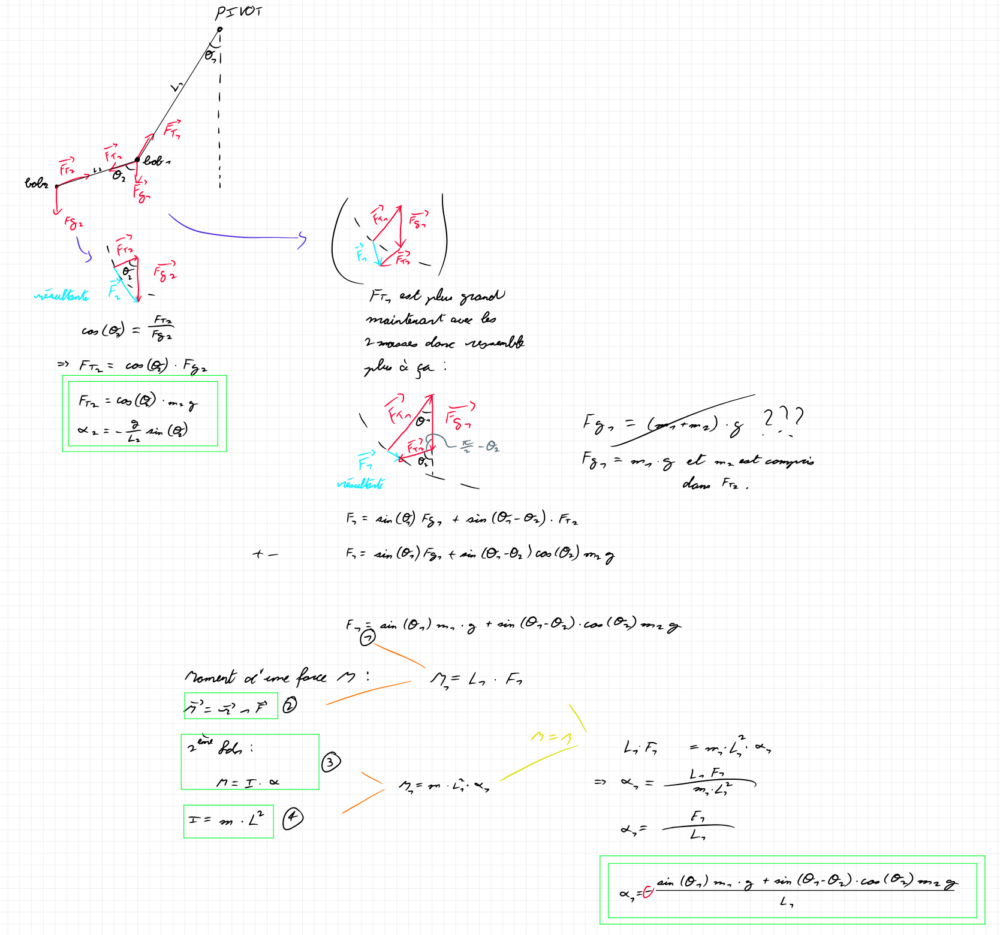

# DoublePendule_Physique
Projet Physique HES-SO Valais-Wallis  
# Objectifs du projet
1. Simuler la dynamique du pendule double et la comparer aux vidéos;
2. Prédire le comportement futur du pendule double;
3. Quantifier la précision des résultats.
## Matos
L1 = 91.74 $[mm]$\
L2 = 69.33 $[mm]$
## Théorie
Le double pendule est un processus chaotique. Cela veut dire qu'il est extrêmement
sensible aux conditions initiales.

Avec les phénomènes choatiques, la précision de calcul influe fortement sur les
résultats produits. En raison des arrondissements et imprefections des calculs
numériques, il est souvent impossible de prédire la nature du phénomène chaotique
sur le long terme.

Cependant, il est possible de prédire et donc simuler les états du futur proche.

Cela est le but de ce projet.    

# Pendule simple
La période d'un pendule simple, ne dépend pas de la masse, juste de la longueur de la tige.

Un système de coordonnées polaire est utilisé pour les calculs.
## Lois et formules
La conservation de l'énergie méchanique est présente. Ce qui fait en sorte que le bout du pendule revient à la même position que la balance précédente.

>Moment d'une force $$\vec{M} = \vec{r} \wedge \vec{F}$$

>Moment d'inertie (formule officielle) $$I = \sum_{i=0}^{N} \Delta m_{i} r_{i}^2$$ 

>Moment d'inertie (formule simplifiée pour le cas du pendule simple)$$I = mL^2$$ 

>2ème Loi de Newton (rotation => Moment) $$M = I \alpha$$ 

## Forces agissant sur un pendule simple
> Force de gravité

Force de soutient ou force de tension
## Résolution
La somme de ces 2 forces mentionées ci-dessus, sont toujours inversément égaux par rapport à l'axe de la tige (rode). Cela veut dire que le bout (bob) reste toujours connectés à la tige, comme quand on voiture sur la route accélère, mais ne tombe jamais "dans le sol".

La seule force fournissante produisant l'accélération du pendule, est ainsi la force résultante, qui est tangente à la tige du pendule. Comme pour la voiture où son accélération est tangentielle par rapport à la route.

> Accélération gravitationelle: $$\vec{g} = 9.81$$
Vitesse angulaire: $$\omega = \frac{\delta \theta}{\delta t}$$
Accélération angulaire: $$\alpha = \frac{\delta \omega}{\delta t} = -\frac{g}{L}sin(\theta)$$ 

<!--  to show it exactly. -->

   

# Double pendule

### <em> Notes
La période d'un double pendule, dépend des deux masses et des longueurs des tiges, ce qui complexifie le problème.

I know the Lagrange version works and is somewhat simpler but I am going to keep using Newton's version.

A simple pendulum's period is not dependent on the mass of the bob, only the length of the rod.
However this changes with a double pendulum.

I presume the best approach is to get the sum of all the forces acting on both bobs similarly to the simple pendulum.

So the forces acting on bob 1 would be gravity, tension towards the pivot and tension towards bob2.
The forces acting on bob2 would be gravity, tension towards bob1. This means that bob2 will keep the same conditions as the simple pendulum, only by taking the pivot as bob1's position instead.

So does this mean that the sum of g on bob1 + tension towards bob2 should be equal to the tension leading to the pivot in the axis of the rod?\
I think so.
</em>

## Lois et formules
La conservation de l'énergie méchanique est présente, ce qui garantie que le pendule bougera à l'infini, sauf dans le cas où sont état initiale est parfaitement équilibré.

Les lois et formules nécessaires, se retrouvent identique que le pendule simple.

## Résolution
<ins>Sur bob1:
> Force de gravité  
Force de soutient vers pivot
Force de soutient vers bob2

<ins>Sur bob2:
> Force de gravité  
Force de soutient vers bob1

Les forces agissant sur bob2 sont identiques à un pendule simple, avec la seule exception que le pivot bouge et se trouve en position de bob1.\
On peut ainsi garder la même méthode vù avec le pendule simple.

Le bob1 à l'ajout de la force de tension vers bob2, ce qui influe directement la force de tension vers le pivot. Nous retrouvons les informations nécessaire avec la méthodologie ci-dessous. 

I think my angles between m1 and m2 are wrong.
I believe I also just removed m1 from the final equation by accident.

This is still wrong, because I assumed that the second pendulum (the one at the end), was a simple pendulum attached to another one, that isn't simple, but takes into account the second one's tension, and therefor wouldn't create any issues.

This is where I went completely wrong, because to assume the second one is a simple pendulum, would to assume that it's pivot is fixed, which is not the case, and therefor my entire logic falls appart completely.

In order to add precision to my calculations, it would be a good idea to split the euler step in shorter steps
while still keeping the correct time signature.

Okay so fixed the equations.
Now there is still an issue.. and it may be farfetched, but I think when I operate with the theta1[end] for example, that it may potentially modify the actual table value. So instead, I am going to initialize hard values at the beginning of iterate(...).
Nope that was not the issue.

Still have the energy accumulation problem.. I think it may have to do with the iterate(step), may be too inaccurate for a double pendulum.

Aight no time to continue.. Have to do some stats.
